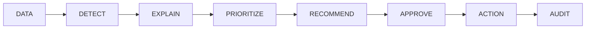
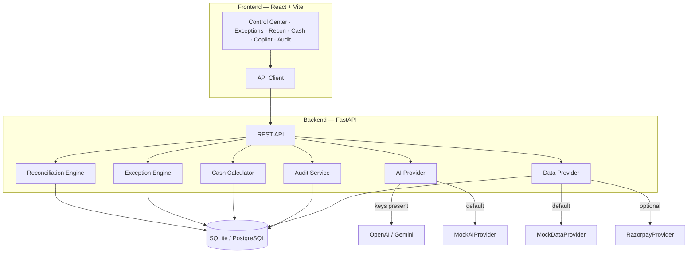

# Finance Control Tower

> An **AI Finance Controller** that continuously controls money flow across payments, settlements, and bank records — detecting exceptions, explaining root cause, quantifying ₹ impact, and recommending actions that only execute after human approval.

Built for **Razorpay AI Builder Internship 2026 — Track 4: AI Finance Controller**.

| | |
|---|---|
| **App** | http://localhost:5173 (local) · Deploy via Render (`render.yaml`) |
| **API** | http://localhost:8000 · interactive docs at `/docs` |
| **Mode** | Demo Mode (Mock AI + Mock Data) — **no API keys required** |
| **GitHub** | [github.com/Aadityaanand2002](https://github.com/Aadityaanand2002) |

---

## What this product is

**Finance Control Tower** is an exception-management system for online merchants.

It does **not** only show financial tables.  
It **understands** when Payment → Settlement → Bank disagrees, explains **why**, scores **how urgent**, recommends **what to do**, and records a human decision in an **audit trail**.

### One-line pitch

> Not another dashboard. An AI finance controller for **exception management** across Payment → Settlement → Bank.

### Problem

Merchants juggle payments, settlements, fees, taxes, refunds, bank credits, invoices, and expenses. When expected settlement and bank credit diverge, finance teams get spreadsheets — not answers.

They still ask:

- What went wrong?
- How much is at risk?
- Why did this happen?
- What should I do next?
- Did someone approve this?

### Solution

A closed control loop:

```text
DATA → DETECT → EXPLAIN → PRIORITIZE → RECOMMEND → APPROVE → ACTION → AUDIT
```

### Why this is not a Razorpay clone

Razorpay already helps merchants **see** settlements and **forecast** cash.  
This product closes the gap when money **does not reconcile**.

| Razorpay-adjacent capability | Finance Control Tower |
|---|---|
| Settlement summaries / digests | Discrepancy **cases** with ₹ impact + root cause |
| Cashflow prediction as hero | Cash is **downstream of control** (at-risk subtracted) |
| Chat / ops agents | Copilot grounded in **recon + exception engines** |
| Fast automated actions | **Recommend → Human Approve → Audit** only |

**Positioning:** complementary control & governance layer beside Razorpay insights — not a Dashboard clone.

---

## How the project works (end-to-end)



### 1. DATA — load financial records

On startup / **Reset Demo**, the seed service loads:

- Payments, settlements, bank transactions  
- Refunds, invoices, expenses  
- Then runs reconciliation + exception detection  

Money is stored as integer **paise** (₹1 = 100 paise).  
Default providers: **MockDataProvider** + **MockAIProvider** (no keys).  
Optional: OpenAI / Gemini / Razorpay provider abstractions via env vars.

### 2. DETECT — Payment → Settlement → Bank matching

The reconciliation engine compares each settlement to related payments and bank credits using:

1. Exact **UTR** match (strongest)  
2. Settlement ID / reference in bank description  
3. **Amount** within ₹1 rounding, fee/tax band, or partial shortfall  
4. **Date** within ±2 days  
5. Fuzzy description similarity (RapidFuzz)

**Possible statuses**

| Status | Meaning |
|---|---|
| Matched | Expected ≈ actual bank credit |
| Partially Matched | Bank credit linked but short (e.g. `set_1024`) |
| Mismatched | Linked but unexplained gap (often fee band) |
| Missing Bank Entry | Settlement exists, no bank credit |
| Duplicate | Same UTR credited more than once |
| Missing Settlement / Unexplained | Incomplete or unclear linkage |

**Worked example (fee mismatch)**

| Step | Amount |
|---|---:|
| Payment captured | ₹18,450.00 |
| Settlement expected (after fee + tax) | ₹18,060.60 |
| Bank credited | ₹17,530.60 |
| **Detected gap** | **₹530.00** |

The system creates an exception with explanation, evidence, and a recommended finance action.

### 3. EXPLAIN — AI root-cause analysis

On exception detail (or `POST /api/exceptions/{id}/analyze`), AI returns structured JSON:

- `summary`, `severity`, `amount_affected`  
- `root_cause`, `confidence`  
- `evidence`, `reasoning`  
- `recommended_action`  
- `requires_human_approval = true`  

**MockAIProvider** builds this from live DB records (deterministic for demos).  
With keys, OpenAI/Gemini can be used; failures fall back to Mock.

### 4. PRIORITIZE — who to investigate first

```text
Priority Score = impact_norm × confidence × recurrence_factor × urgency_factor × 100
```

| Severity | Typical meaning |
|---|---|
| Critical | Large ₹ exposure / high score (demo hero: `set_1024` @ **100**) |
| High | Material gap, overdue / high-value |
| Medium | Smaller mismatches / recurring fee bands |
| Low | Low-impact noise |

Recurring patterns (e.g. multiple ₹500–₹600 fee gaps) increase priority and surface in Copilot.

### 5. RECOMMEND — suggested next step

Examples:

- Request settlement review / create reconciliation case  
- Request supporting settlement info from bank / PSP  
- Escalate recurring fee discrepancy pattern  
- Flag duplicate bank credit for reversal investigation  

AI **never** silently moves money.

### 6. APPROVE — human-in-the-loop

On the exception detail page, finance can:

| Action | New status |
|---|---|
| Mark under review | `under_review` |
| Approve action | `action_approved` |
| Reject | `rejected` |
| Resolve | `resolved` |

### 7. ACTION — live state updates

After a decision:

- Exception status persists in SQLite/Postgres  
- Control Center KPIs refresh from DB (not hardcoded UI)  
- Cash at-risk updates from open / under_review / action_approved exceptions  

### 8. AUDIT — immutable proof

Every AI recommendation and human decision is stored with:

- Actor (e.g. Finance Admin)  
- Entity ID (e.g. `set_1024`)  
- AI recommendation text  
- User decision  
- Old status → new status  
- Timestamp  

---

## Hero demo narrative (`set_1024`)

This is the story evaluators should see:

| Field | Value |
|---|---|
| Settlement | `set_1024` |
| Payments | `pay_1024a` + `pay_1024b` |
| Expected settlement | ₹1,42,500 |
| Bank credit | ₹1,00,000 |
| Gap | **₹42,500** |
| Recon status | Partially Matched |
| Severity | **Critical** · priority **100** |
| Root cause | Partial settlement |
| Confidence | ~94% |
| Required | Human approval before action |

**Flow to demo:** Detect → Explain → Prioritize → Recommend → Approve → Audit.

---

## How each screen works

| Page | What it does |
|---|---|
| **Control Center** | Live unreconciled exposure, Financial overview KPIs, cash trend, severity charts, high-priority queue, activity stream — all from `/api/dashboard` |
| **Exceptions** | Prioritized queue with filters (severity, status, type, min amount) |
| **Exception detail** | Payment → Settlement → Bank chain, expected vs actual, AI analysis, approve/reject/resolve |
| **Reconciliation** | Per-settlement match view; **Run reconciliation** re-runs the engine |
| **Cash Impact** | Control-adjusted projected cash with transparent calculation steps |
| **AI Copilot** | Grounded Q&A on live exceptions / cash / patterns (not a generic chatbot) |
| **Audit Trail** | Filterable log of AI + human decisions |

### Navbar demo controls

| Button | What actually happens |
|---|---|
| **Run Simulation** | Inserts payment + settlement + bank discrepancy → detects exception → emits activity → KPIs update |
| **Generate** | Creates a crafted high-value exception end-to-end |
| **Reset Demo** | Clears sim/gen noise and reseeds narrative (~₹2.84L unreconciled, 9 active exceptions) |

---

## Cash impact math

Projected net cash is control-adjusted:

```text
Available Cash
+ Expected Settlements
+ Pending Receivables
− Upcoming Expenses
− Outstanding Refunds
− At-Risk / Unreconciled (open exceptions)
= Projected Net Cash
```

If expenses + at-risk exceed inflows, Cash Impact surfaces **cash risk**.  
This is intentional: cash is downstream of exception control.

---

## Architecture



### Backend engines

| Module | Responsibility |
|---|---|
| `reconciliation/` | Payment → Settlement → Bank matching |
| `exceptions/` | Detection, scoring, pattern RCA, demo priority overrides |
| `ai/` | Structured analysis + finance copilot |
| `cash/` | Control-adjusted cash projection |
| `audit/` | Immutable decision logging |
| `simulation/` | Demo injectors (simulation / generate) |
| `services/` | Seed + dashboard aggregations |
| `providers/` | Mock + Razorpay data abstractions |

### Frontend pages

`Control Center` · `Exceptions` · `Exception Detail` · `Reconciliation` · `Cash Impact` · `AI Copilot` · `Audit Trail`

---

## Seeded scenarios (what Reset Demo loads)

| Settlement | Story |
|---|---|
| `set_1001` | Perfect match |
| `set_1002` | Fee discrepancy ~₹530 |
| `set_1024` | **Critical partial** — ₹42,500 (demo hero) |
| `set_1004` | Missing bank entry |
| `set_1005` | Duplicate UTR |
| `set_1006`–`set_1009` | Recurring ₹500–₹600 fee band |
| `set_1010` | Refund impact |
| `set_1030` | Large missing bank (helps drive ~₹2.84L unreconciled) |

**Baseline after Reset Demo:** ₹2.84L unreconciled · 9 active exceptions · `set_1024` Critical @ score 100.

---

## AI Copilot (how it answers)

`POST /api/ai/query` intent-routes against **live** DB aggregates, for example:

- How much is unreconciled?  
- Highest-priority exception?  
- Why is this high priority?  
- Largest discrepancy?  
- Recurring fee patterns?  
- Current cash position?  
- What happened to `set_1024`?  

Non-finance prompts (e.g. jokes) are deflected — it stays a finance controller, not a general chatbot.

---

## Tech stack

| Layer | Stack |
|---|---|
| Frontend | React, TypeScript, Vite, Tailwind CSS, Recharts, Lucide |
| Backend | Python, FastAPI, Pydantic, SQLAlchemy |
| Database | SQLite (local) / PostgreSQL (Docker) |
| AI | MockAIProvider (default), OpenAI, Gemini |
| Data | MockDataProvider (default), RazorpayProvider abstraction |

### Database schema (core)

`payments` · `settlements` · `bank_transactions` · `refunds` · `invoices` · `expenses` · `exceptions` · `audit_logs` · `activity_events`

---

## API map

| Method | Path | Purpose |
|---|---|---|
| GET | `/api/health` | Health + provider mode |
| GET | `/api/dashboard` | Live KPIs |
| GET | `/api/payments` | Payments |
| GET | `/api/settlements` | Settlements |
| GET | `/api/bank-transactions` | Bank ledger |
| GET | `/api/exceptions` | Filterable exceptions |
| GET | `/api/exceptions/{id}` | Investigation detail |
| POST | `/api/reconciliation/run` | Run matching engine |
| GET | `/api/reconciliation` | Match results |
| POST | `/api/exceptions/{id}/analyze` | AI analysis |
| POST | `/api/exceptions/{id}/review` | Mark under review |
| POST | `/api/exceptions/{id}/approve` | Human approve |
| POST | `/api/exceptions/{id}/reject` | Reject |
| POST | `/api/exceptions/{id}/resolve` | Resolve |
| GET | `/api/audit-log` | Audit trail |
| GET | `/api/cash-position` | Cash math |
| POST | `/api/ai/query` | Finance copilot |
| POST | `/api/simulation/run` | Demo simulation |
| POST | `/api/simulation/generate-exception` | Crafted exception |
| POST | `/api/demo/reset` | Reseed narrative |

Interactive docs: http://localhost:8000/docs

---

## Local setup

### Backend

```bash
cd backend
python3.12 -m venv .venv
source .venv/bin/activate
pip install -r requirements.txt
cp ../.env.example .env   # optional — defaults to SQLite + demo mode
PYTHONPATH=. uvicorn app.main:app --reload --port 8000
```

Optional live AI:

```bash
pip install -r requirements-ai.txt
# set OPENAI_API_KEY or GEMINI_API_KEY and AI_PROVIDER=openai|gemini
```

### Frontend

```bash
cd frontend
npm install
npm run dev
```

Open http://localhost:5173  
(Vite proxies `/api` → `http://localhost:8000`)

### Docker

```bash
docker compose up --build
```

- Frontend: http://localhost:5173  
- Backend: http://localhost:8000  
- Postgres: localhost:5432  

### Deploy (GitHub + Render)

1. Push this repo to your GitHub account ([Aadityaanand2002](https://github.com/Aadityaanand2002)).
2. On [Render](https://render.com), create a new **Blueprint** and point it at the repo (uses `render.yaml` + root `Dockerfile`).
3. Render builds one Docker image that serves **UI + API** together (SQLite demo, Mock AI).
4. After deploy, open the Render URL — same app as local, no API keys needed.

Manual single-container build:

```bash
docker build -t finance-control-tower .
docker run --rm -p 8000:8000 finance-control-tower
```

Then open http://localhost:8000

---

## Environment

See [`.env.example`](.env.example):

| Variable | Default | Notes |
|---|---|---|
| `DEMO_MODE` | `true` | Demo UX |
| `DATABASE_URL` | SQLite file | Or `postgresql+psycopg://…` |
| `AI_PROVIDER` | `mock` | `openai` / `gemini` when keyed |
| `OPENAI_API_KEY` / `GEMINI_API_KEY` | empty | Backend only |
| `DATA_PROVIDER` | `mock` | `razorpay` when configured |
| `RAZORPAY_KEY_ID` / `SECRET` | empty | Optional provider |
| `CORS_ORIGINS` | Vite origins | Comma-separated |

**Never commit `.env` or put secrets in frontend code.**

---

## 5-minute live demo

1. Click **Reset Demo** → ~₹2.84L unreconciled, 9 exceptions  
2. **Control Center** → Financial overview + exposure banner  
3. **Exceptions** → open Critical **`set_1024`** (₹42,500)  
4. Show Payment → Settlement → Bank · Expected ₹1,42,500 vs Actual ₹1,00,000  
5. **Re-run AI analysis** → partial settlement · ~94% · recommended action  
6. Say *“AI never acts alone”* → **Approve Action** → `action_approved`  
7. **Audit Trail** → Approved · old → new status  
8. **Run Simulation** → new exception; KPIs move  
9. **AI Copilot** → *Why is this our highest-priority financial issue?*  
10. Close → *Control layer for exceptions — complementary to Razorpay insights & forecasts*

---

## Testing & verification

```bash
# Live E2E harness (API + frontend must be running)
backend/.venv/bin/python scripts/e2e_verify.py

# Backend unit/integration
PYTHONPATH=backend pytest tests/backend -q

# Frontend
cd frontend && npm test -- --run && npm run build
```

Verified locally: **56/56 E2E PASS** · **10** backend tests · **3** frontend tests · production build OK.

---

## Project structure

```text
finance-control-tower/
  frontend/                 # React + Vite UI
  backend/app/
    api/                    # REST routes
    reconciliation/         # Matching engine
    exceptions/             # Detection + scoring + demo overrides
    ai/                     # Mock / OpenAI / Gemini providers
    cash/                   # Control-adjusted cash
    audit/                  # Immutable audit log
    simulation/             # Demo injectors
    providers/              # Mock + Razorpay data
    services/               # Seed + dashboard aggregations
  database/                 # Schema / migration notes
  scripts/e2e_verify.py     # Independent verification harness
  tests/backend/            # Pytest suite
  docker-compose.yml
  README.md                 # This file — full product + working guide
```

---

## Future scope

- Live Razorpay webhooks + continuous reconciliation  
- Multi-merchant tenancy, RBAC / SSO  
- Case management (email / Slack finance requests)  
- Learning on fee-schedule drift  
- Exportable board packs and regulator-ready audit bundles  

---

## About the Developer

**Aditya Anand**  
B.Tech — Electronics & Communication Engineering  
Indian Institute of Information Technology, Surat (IIIT Surat)

I am a 4th-year engineering student focused on software development, AI/ML, full-stack systems, and shipping practical technology products end-to-end.

This project was built for the **Razorpay AI Builder Internship 2026 — Track 4: AI Finance Controller**.

**Links**

- GitHub: [github.com/Aadityaanand2002](https://github.com/Aadityaanand2002)
- Portfolio: [portfolio-olive-nine-46.vercel.app](https://portfolio-olive-nine-46.vercel.app)
- LinkedIn: [linkedin.com/in/adityaanand15902](https://www.linkedin.com/in/adityaanand15902)

### My Contribution

I owned complete product development for **Finance Control Tower**, including:

- Product concept and problem framing (exception control, not a dashboard clone)
- Finance-control workflow design: **DATA → DETECT → EXPLAIN → PRIORITIZE → RECOMMEND → APPROVE → ACTION → AUDIT**
- Payment → Settlement → Bank reconciliation engine
- Financial exception detection, severity, and priority scoring
- AI-powered root-cause analysis with structured evidence
- AI Finance Copilot grounded in live application data
- Human-in-the-loop approval / reject / resolve workflow
- Control-adjusted cash-impact analysis
- Immutable audit trail and activity tracking
- Demo-mode simulation, generate-exception, and reset flows
- Frontend ↔ backend integration (React + FastAPI)
- Testing, E2E verification, and demo packaging
- Product UI/UX aligned to a Razorpay-adjacent fintech experience

### Technology

**Frontend:** React, TypeScript, Vite, Tailwind CSS, Recharts  
**Backend:** Python, FastAPI, Pydantic, SQLAlchemy  
**Database:** SQLite (local demo) / PostgreSQL (Docker)  
**AI:** MockAIProvider (default), OpenAI, Gemini  
**Other:** REST APIs, reconciliation engine, exception engine, simulation engine, audit logging

### Project Focus

The goal is to show how AI can move beyond displaying financial tables and instead help finance teams close the loop when money does not reconcile:

**Detect → Explain → Prioritize → Recommend → Approve → Action → Audit**

The system is human-in-the-loop by design: AI analyzes exceptions and recommends actions, while material financial decisions always require human approval and leave an audit trail.

> Built with a focus on practical AI, financial intelligence, explainability, and production-oriented software engineering.

---

## License

MIT — built as an internship track demonstration.
